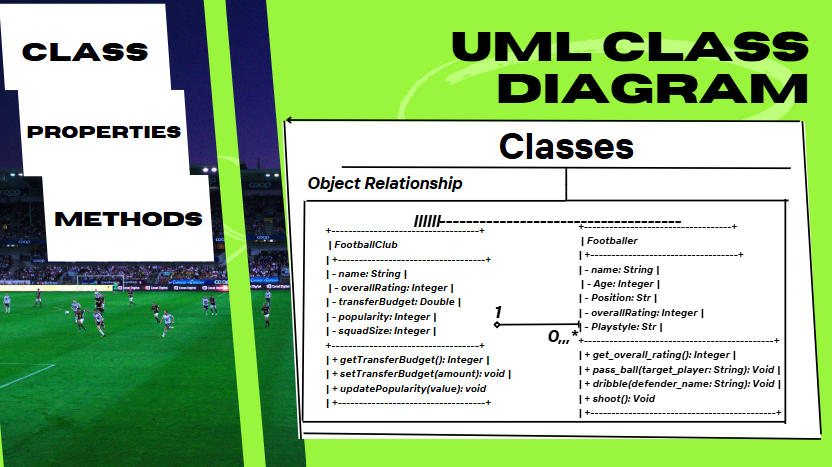
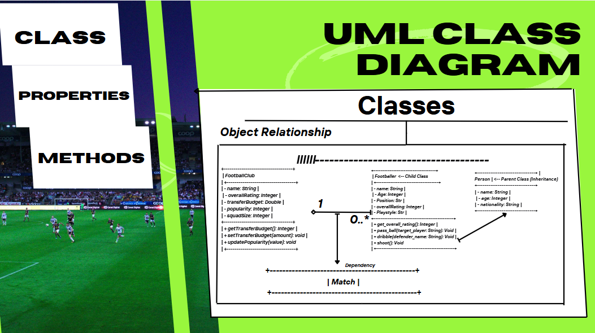
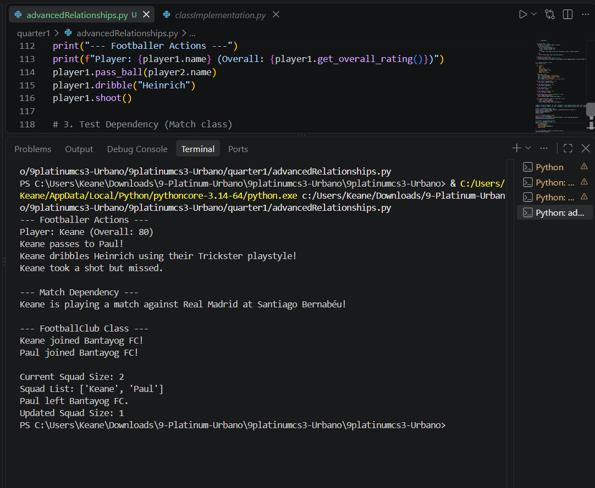
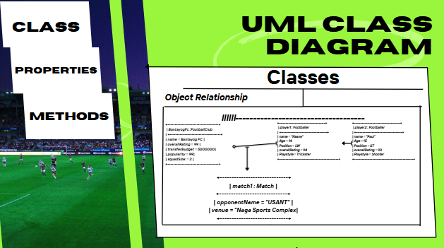

# Advanced Class Relationships
## Previous Activities
[classAttrib](classAttributesMethods.md)
[classRel](classRelationships.md)
## Existing System Description:
I have 2 classes, Footballer and FootballClub. Footballer represents people who plays football, while on the other hand FooballClub represents
the entities who employ Footballers. 

## Inheritance Relationship

Parent: FootballClub
Child:- Footballer
Explanation: FootballClubs need Footballers to play for it while Footballers can only play for one club at a time. 

## Inheritance UML

## Composition/Aggregation

Relationship:
Explanation:

## Advanced UML Diagram

## Python Implementation
[Source Code](advancedRelationships.py)

## Test Run

## Object Diagram

## Reflection
Answers:
