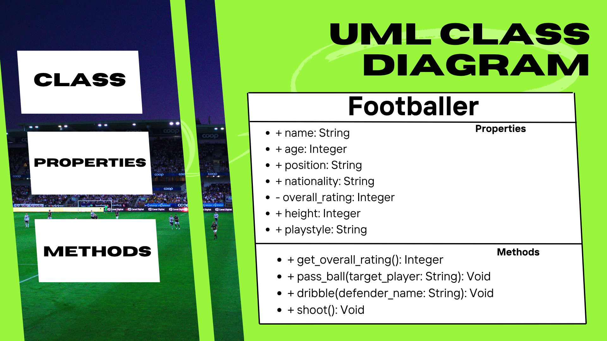
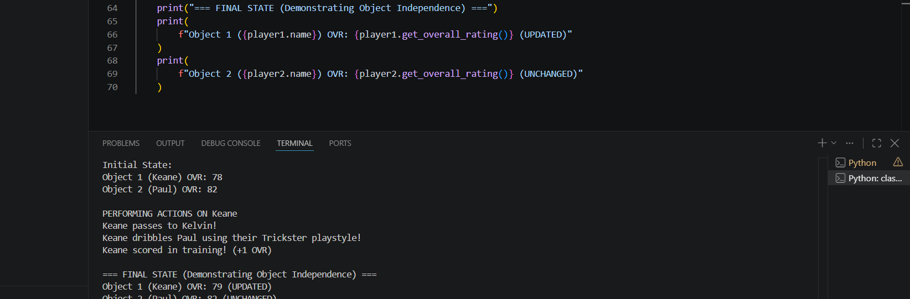

# Class Attributes and Methods

## Previous Design
Link to my previous activity:
[classObjectUML.md](classObjectUML.md)
## Design Revision
Changes I made from my previous design:
- Encapsulation: I turned overall_rating into a private attribute (__overall_rating) to protect internal player stats from direct external manipulation.
- Method Upgrades: Replaced generic action labels (run, pass, dribble, shoot) with specified OOP methods that handle things from parameters, to safely reading.
- private attributes:
  - pass_ball(target_player): Takes a target player parameter to simulate passing.
  - shoot(): Contains logic to modify the private __overall_rating` attribute upon scoring.
## Visibility Decisions
| Attribute | Data Type | Visibility | Reason |
|---|---|---|---|
| name | String | Public (+) | A basic player identifier that can be freely read or updated. |
| age | Integer | Public (+) | Standard player trait that does not require strict access control. |
| position | String | Public (+) | Pitch location (e.g., LW, ST) that can be changed or read publicly. |
| nationality | String | Public (+) | General player demographic data that is safe for public access. |
| overall_rating | Integer | Private (-) | Core performance stat that must be protected from direct, illegal external edits (e.g., setting to -10 or 999). |
| height | Integer | Public (+) | Physical metric that does not affect critical program logic. |
| playstyle | String | Public (+) | Aesthetic trait describing play style; safe to read publicly. |
## Updated UML Class Diagram

## Python Implementation

[View Python Source](classImplementation.py)
## Test Run

## Object Diagram

## Analysis
### Why did you make your chosen attribute private?
 I made overall_rating private ( __overall_rating) because it is an important performance metric that impacts player value and capability. iF other parts of the program could modify this value 
directly. Invalid or unrealistic stats like setting a number above 99 or 0. Enforcing encapsulation make sure that player ratings are only modified through valid logic.
### Which method changes the state of your object?
The shoot() method changes the state of a Footballer object. When a goal is scored the overall_rating jumps by one attribute directly updating the stored data of the player instance.
### How did your two objects demonstrate that instances are independent?
When actions were performed by player1 that boosted its __overall_rating from 78 to 79, player2 maintained its initial rating of 82 completely unchanged.
This clear difference in state in the output proves that each object occupies its own memory space and operates independently.

### What is the difference between your class diagram and your object diagram?
My class diagram serves as a blueprint that defines the structure, attributes, data types, , and available methods for any Footballer. In contrast, my object diagram represents a concrete process snapshot of specific instances (player1 and player2) at a given moment, displaying their actual assigned values rather than just data types.

