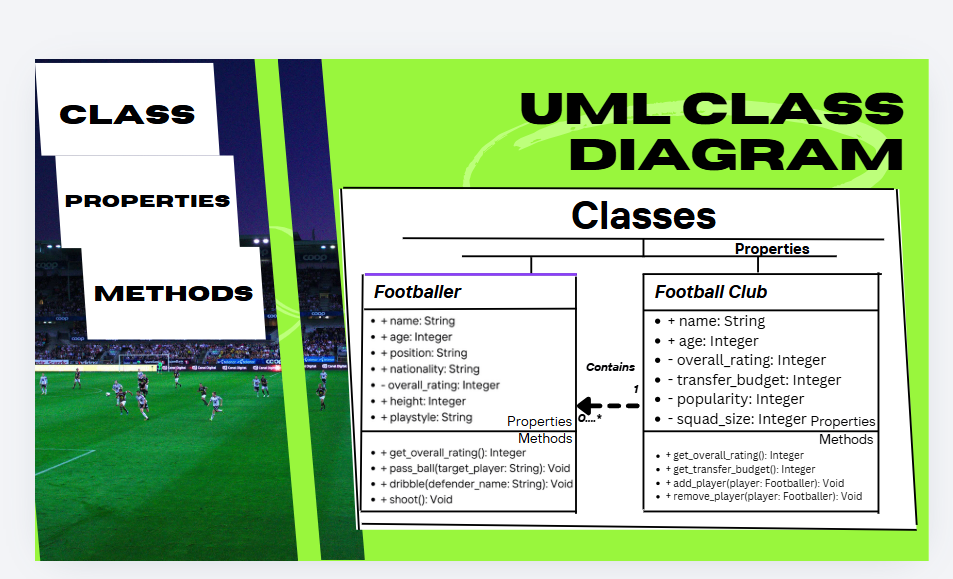
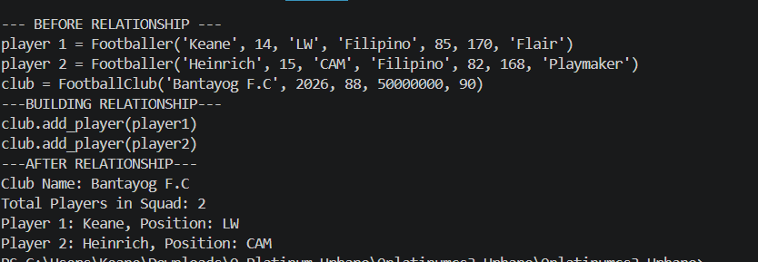
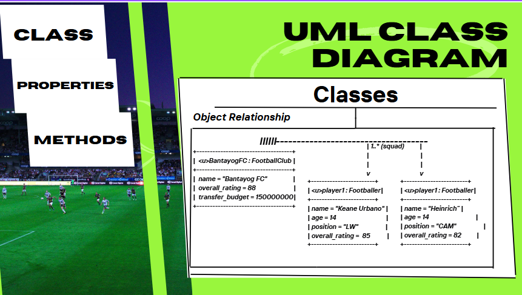

# Class Relationships: Association and Multiplicity
## Previous Work

[Part I - Classes and Objects](classObjectUML.md)
[Part II - Class Attributes and Methods](classAttributesMethods.md)
## Existing Class
Class: Footballer
Description: They are people who play football for a variety of reasons, it could be their full time job or a hobby they like to do.
## New Related Class
Class:Football Club
Description: These are professional establishments created for the purpose of participating in football competitions. They vary from level to level with some worth less
than a few thousand dollars to billions of dollars. Some football clubs are businesses and others are passionate. 
## Association
Relationship: Football Club manages Footballers.
Explanation: Football Clubs employs Footballers to play for their club.
## Multiplicity

Multiplicity:
Explanation:
## UML Class Relationship Diagram

## Python Implementation
[View Python Source](classRelationships.py)
## Test Run

## Object Relationship Diagram

## Analysis
### What is the association between your two classes?
### What multiplicity did you choose and why?
### How did you implement the relationship in Python?
### Why did you store an object reference instead of copying its data?
### If your relationship uses many, why is a list appropriate?
